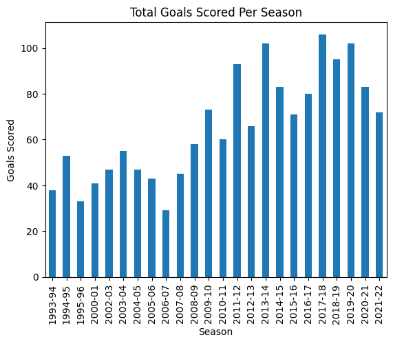
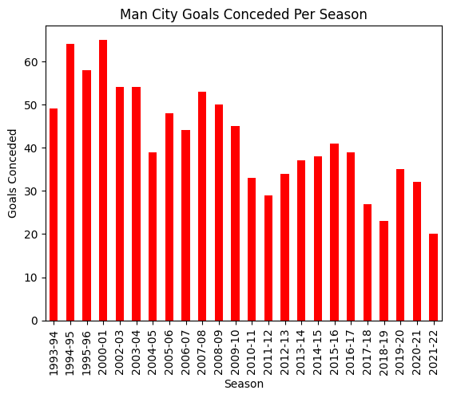
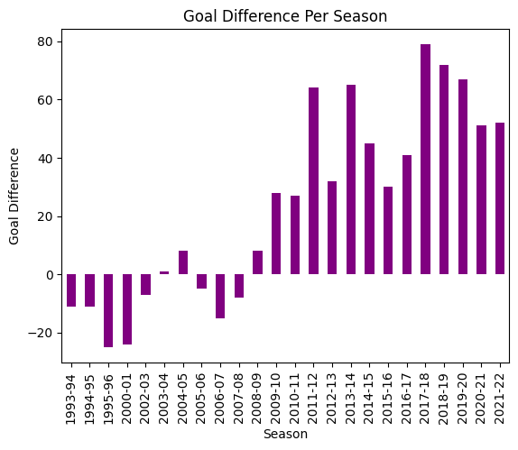
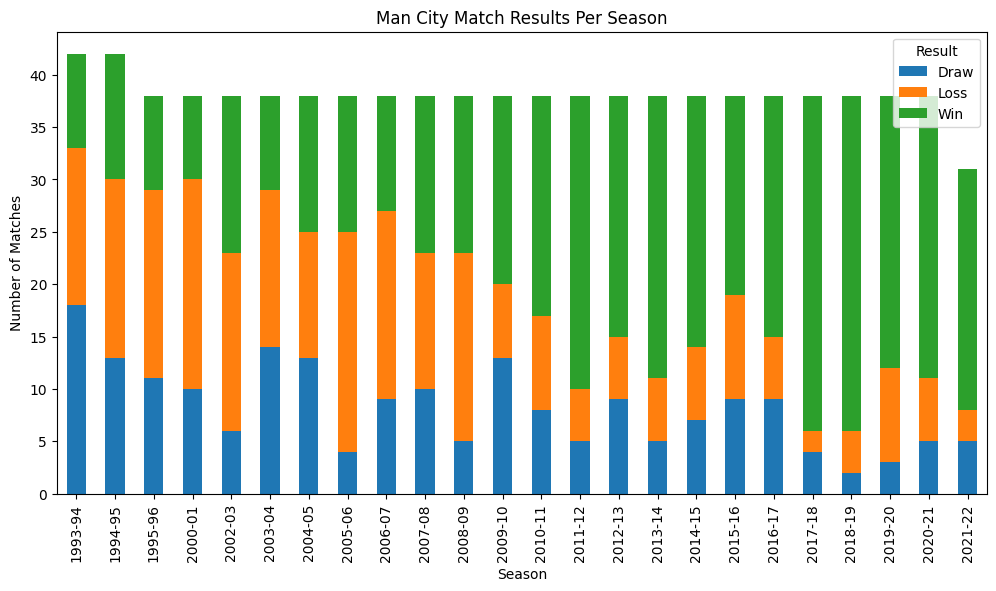

# Manchester City Football Match Analysis 

This is a data analysis project exploring Manchester City's match performance from 1993 onwards using real-world match result data.

## 📁 Files Included
- `man_city_analysis.ipynb`: Main analysis notebook (Google Colab)
- `results.csv`: Raw dataset used
- `README.md`: Project description
- `mc analysis screenshots/`: Visuals from the notebook

## Visual Insights

### Goals Scored Per Season

### Goals Conceded per Season

### Goal Difference

### Match Results (Win/Draw/Loss)

## What This Project Covers
- Filtering Manchester City matches from 1993 onward
- Calculating goals scored and conceded per match
- Season-wise total goals scored
- Season-wise goal difference
- Stacked bar chart showing win/draw/loss distribution per season

## Tools Used
- Python
- Pandas
- Matplotlib
- Google Colab

## Dataset Source
Premier League results dataset sourced from [Kaggle](https://www.kaggle.com).
